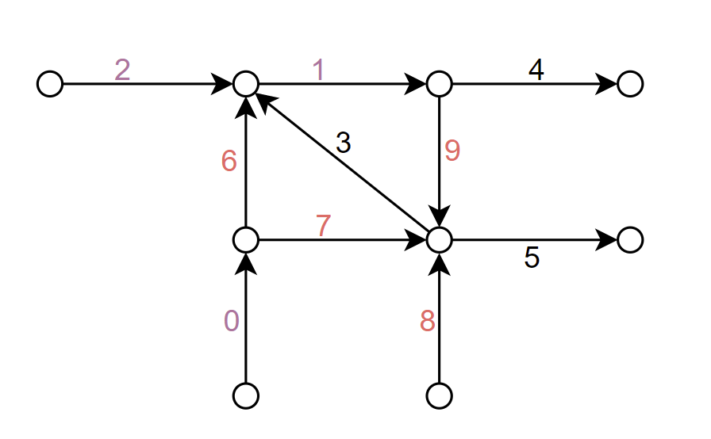
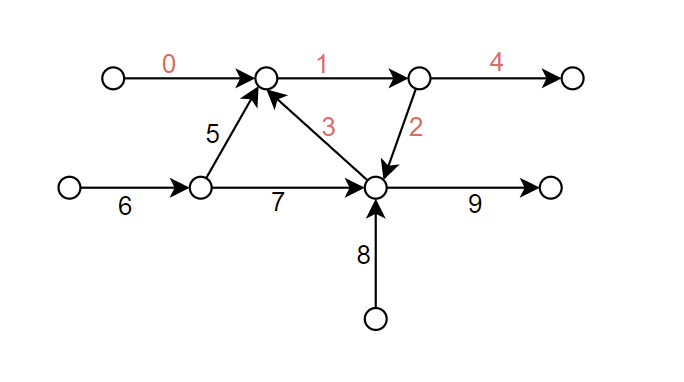

# ParallelDFS
Deep first search (DFS) parallel implementatoin based on MPI.

每个进程上会执行两个线程，一个线程作为server,一个作为client。server用于响应client对于下一条边是什么的查询。其这次实现可适用于单节点可用内存很小的情况，因为在查询路径的时候，采用了只保存一定长度的路径即进行数据的写入文件的策略。

## Example 3: circle exit among processes



+ P0: 0 1 2
+ P1: 3 4 5
+ P2: 6 7 8 9


## Example 4: circle exit in a process



+ P0: 0 1 2 3 4
+ P1: 5 6 7 8 9


## Memory-constrain implementation
从拥有全局起始点的进程出发，一条一条边的进行延长，在各个进程本地会保存一个信息列表格式如下
```c++
<path_id, start_edge, count>
```
其中`path_id`的数据格式为前32位保存`process_id`后32位保存`local_path_count`。

针对每个start_edge 进行搜索是还需要两个变量进行传递`<cur_fork, next_fork>`分别表示当前搜索在那个岔路可以进行变道和下一个可以进行变道的岔路口（都是edge的编号）。
